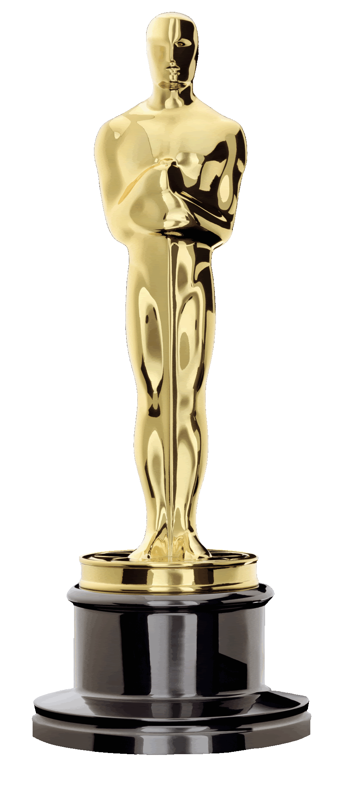
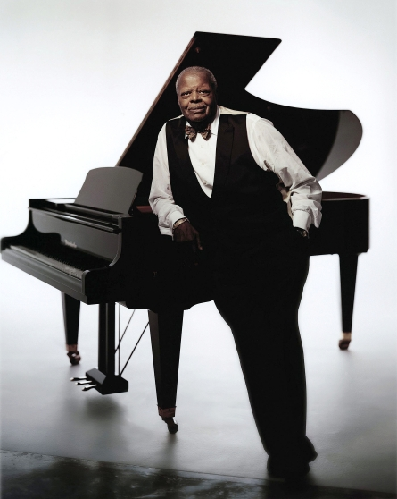
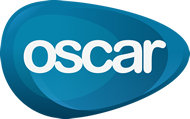
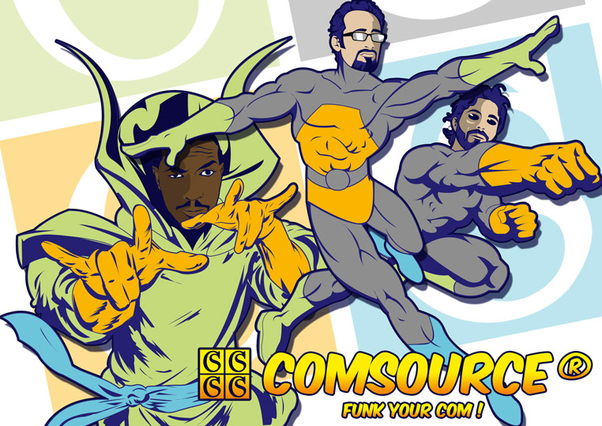

# Django 
## mérite bien un
# Oscar

#### DjangoCong 2013
<small>September, 28th 2013 - UTMB, Belfort, France</small>

<small>[Julien Maupetit](http://julien.maupetit.me) / [@julienmaupetit](http://twitter.com/julienmaupetit)</small>

---

#### Oscar statuette

--

##### Oscar Peterson

--

## Django Oscar

#### Framework e-commerce pour Django

[https://github.com/tangentlabs/django-oscar](https://github.com/tangentlabs/django-oscar)

---

## Pourquoi utiliser Oscar ?

--

# Domain Driven

--

## Batzeko.com

Site multi-boutiques de vente en ligne.

--

## Templates

-- 

## Models

-- 

## Views

---

## Merci !

