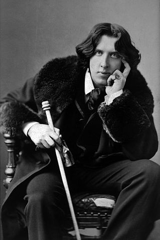

# Django 
## mérite bien un
# Oscar

#### DjangoCong 2013
<small>September, 28th 2013 - UTMB, Belfort, France</small>

<small>[Julien Maupetit](http://julien.maupetit.me) / [@julienmaupetit](http://twitter.com/julienmaupetit)</small>

---

#### Oscar statuette

--

#### Oscar Wilde

--

##### Oscar Peterson

--

## Django Oscar

#### Framework e-commerce pour Django

[https://github.com/tangentlabs/django-oscar](https://github.com/tangentlabs/django-oscar)

---

# Pourquoi 
### utiliser 
## django-oscar ?

--

# “Domain Driven”

---

## [Batzeko.com](http://batzeko.com)

#### Site multi-boutiques de vente en ligne.

--

## Templates

    # settings.py

    TEMPLATE_LOADERS = (
        'django.template.loaders.filesystem.Loader',
        'django.template.loaders.app_directories.Loader',
    )

    TEMPLATE_DIRS = (
        location('templates'),
    )

    from oscar import OSCAR_MAIN_TEMPLATE_DIR
    TEMPLATE_DIRS = TEMPLATE_DIRS + (OSCAR_MAIN_TEMPLATE_DIR,)

--

## Templates: override

    # base.html

    

    
        <link rel="stylesheet" type="text/css" href="" />
        <link rel="stylesheet" type="text/css" href="" />
        <link rel="stylesheet" type="text/css" href="" />
    

--

## Templates: extend

    # base.html

    

    
        {{ block.super }}
        ...
    

--

## Oscar apps ...

    # settings.py

    from oscar import get_core_app

    INSTALLED_APPS = [
        'django.contrib.auth',
        ...
    ] + get_core_apps(
        overrides=(
            'apps.catalogue',
            'apps.checkout',
            'apps.promotions',
        )
    )

### ... are dynamically loaded

    from django.db.loading import get_model

    Category = get_model('catalogue', 'Category')

--

#### App label must be the same as parent app

    apps
    ├── __init__.py
    ├── catalogue
    │   ├── __init__.py
    │   ├── app.py
    │   ├── models.py
    │   ├── views.py
    ├── checkout
    │   ├── __init__.py
    │   ├── app.py
    │   ├── models.py
    │   ├── views.py
    └── promotions
        ├── __init__.py
        ├── app.py
        ├── models.py
        └── views.py

--

## `models.py`

    from django.db import models
    from django.utils.translation import ugettext_lazy as _

    from oscar.apps.catalogue.abstract_models import AbstractCategory

    class Category(AbstractCategory):
        """
        Link categories to stores
        """
        store = models.ForeignKey('stores.Store', related_name='categories',
                                  null=True, blank=True)

    from oscar.apps.catalogue.models import *

--

## `views.py`

    from oscar.apps.checkout import views

    class PaymentDetailsView(views.PaymentDetailsView):

        def handle_payment(self, order_number, total_incl_tax, **kwargs):
            # Get PayPal transaction
            try:
                adaptive_transaction = AdaptiveTransaction.objects.get(
                    pay_key=self.pay_key)
            except:
                raise exceptions.UnableToTakePayment(
                    _('PayPal adaptive transaction not found!'))
            #...

---

## Merci !

